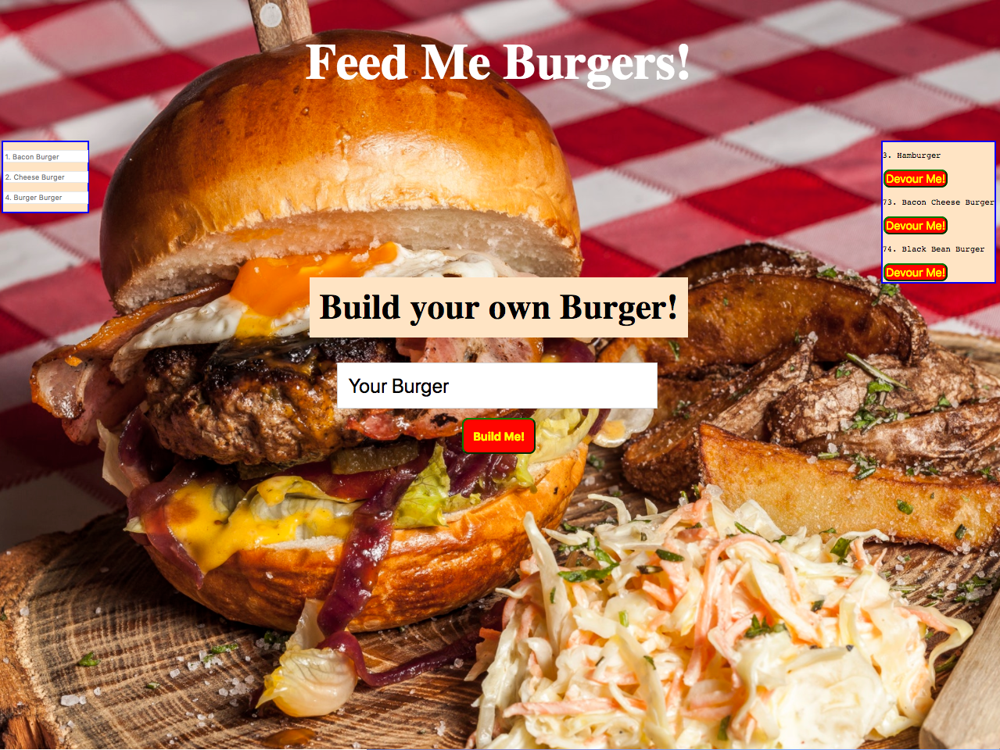

# Feed-me-burgers
A fullstack application that takes allows to you Build your own burger

 

 ***
## Getting Started

 - Clone repo.
 - Run `npm install` in command line.
 - Run `node server.js` in command line.
 - Build your own burger, Devour it. If you still are hungry try one on the menu or build your own again! 

***
## Technologies Used:

 * Node.js
 * Express.js
 * Handlebars.js
 * MySQL
 * HTML5
 * CSS3

***
##  Installs

### Body-parser
 - `npm install body-parser`

### Express
 - `npm install express`
 
### Express-Handlebars
 - `npm install express-handlebars`

### Method-override
 - `npm install method-override`

### MySQL
 - `npm install mysql`
***
## Heroku
You can try it out now at [Feed-Me-Burgers](https://arcane-escarpment-22495.herokuapp.com/).

***
## Contributors: 

 - Derek Frand [GitHub](https://github.com/Dfrand)
 